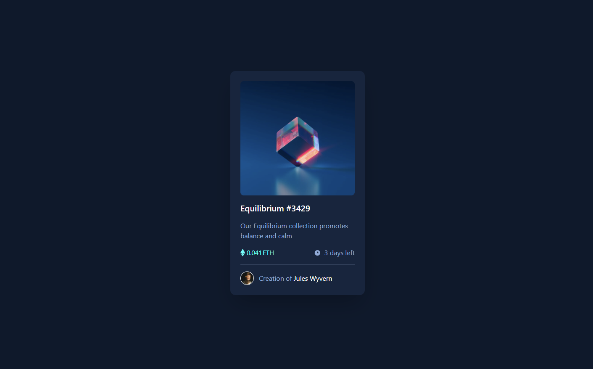
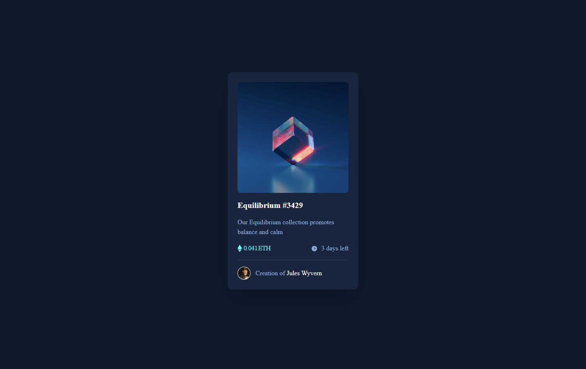

# Frontend Mentor - NFT preview card component solution

This is a solution to the [NFT preview card component challenge on Frontend Mentor](https://www.frontendmentor.io/challenges/nft-preview-card-component-SbdUL_w0U). Frontend Mentor challenges help you improve your coding skills by building realistic projects.

## Table of contents

- [Overview](#overview)
  - [The challenge](#the-challenge)
  - [Screenshot](#screenshot)
  - [Links](#links)
- [My process](#my-process)
  - [Built with](#built-with)
  - [What I learned](#what-i-learned)
- [Author](#author)

## Overview

### The challenge

Users should be able to:

- View the optimal layout depending on their device's screen size
- See hover states for interactive elements

### Screenshot

With default font

With outfit font

### Links

- [Solution URL](https://github.com/Stiixxy/fm-qr-code)
- [Live Site URL](https://stiixxy.github.io/fm-qr-code/)

## My process

### Built with

- Svelte & Vite
- TailwindCSS

### What I learned

Getting a bit more familiar with layouts again, how to center properly etc.

I feel quite happy with the layout structure. Im not sure if the image overlay is the best solution.

I still struggly to make the text look the same as the design, any tips on this regards are appreciated.

## Author

- Frontend Mentor - [@Stiixxy](https://www.frontendmentor.io/profile/Stiixxy)
